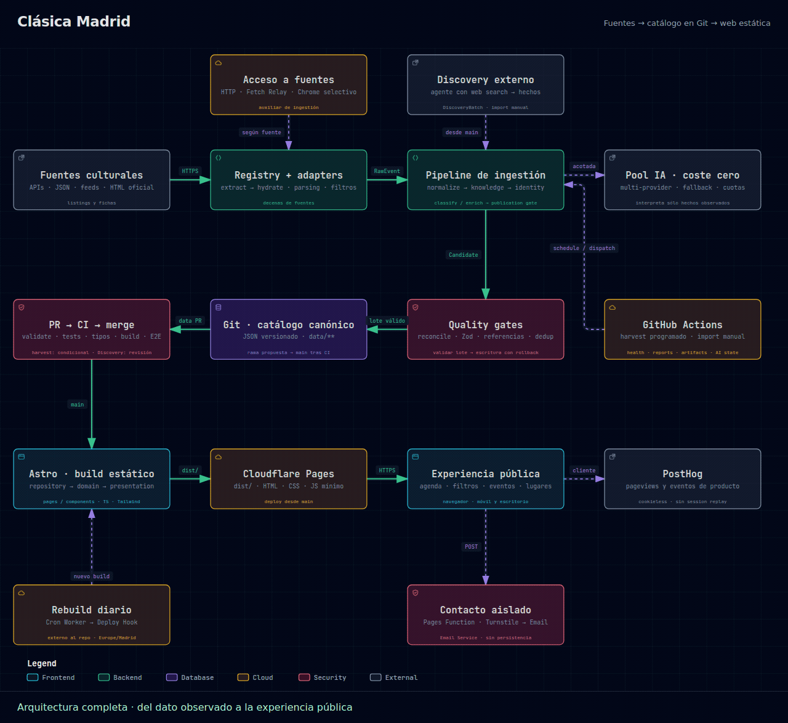

# Clásica Madrid

Agenda pública de conciertos y eventos de música clásica en Madrid y su entorno inmediato.

El producto y su alcance están en [`PROJECT_CONTEXT.md`](PROJECT_CONTEXT.md). Las decisiones de arquitectura están en [`ARCHITECTURE.md`](ARCHITECTURE.md). Este README cubre cómo trabajar con el código y los datos.

<p align="center">
  <a href="./docs/architecture/architecture.svg">
    
  </a>
</p>

<p align="center">
  <a href="./docs/architecture/architecture.html">HTML interactivo (descargar y abrir)</a> ·
  <a href="./docs/architecture/architecture.svg">SVG completo</a> ·
  <a href="./ARCHITECTURE.md">Documentación técnica</a> ·
  <a href="./docs/architecture/README.md">Regenerar</a>
</p>

## Requisitos

- Node 22+ (véase `engines` en `package.json`)

## Comandos

Los scripts están definidos en `package.json`. Tras `npm install`:

```bash
npm run dev          # http://localhost:4321
npm run validate     # esquemas, referencias y duplicados de data/
npm test             # Vitest
npm run check        # astro check (tipos y diagnósticos)
npm run build        # sitio estático en dist/
npm run preview      # sirve dist/
```

Ingestión (operación actual): [`docs/ingestion.md`](docs/ingestion.md). Política editorial: [`docs/classification-policy.md`](docs/classification-policy.md). Evolución restante de la ingestión: [`docs/ingestion-v3-plan.md`](docs/ingestion-v3-plan.md).

```bash
npm run ingest:sync              # extrae las fuentes del registry, valida el lote y escribe
npm run ingest:sync -- --dry-run
npm run ingest:source -- auditorio-nacional
npm run ingest:promote -- ingestion/inbox/evento.json   # legacy: un candidato en disco
```

Diagnóstico live one-shot del pool de IA (quota real; sin retries/fallback y no corre en CI de push/PR): [`docs/ai-providers.md`](docs/ai-providers.md). En GitHub: Actions → **AI live smoke test**; deja `route` vacío para probar todo el pool o indica `provider:model` para aislar una route.

```bash
npm run ai:smoke:all
npm run ai:smoke:all -- --all-purposes
npm run ai:smoke -- --route provider:model
npm run ai:smoke -- --route provider:model --all-purposes
```

El formulario público de contacto usa una Cloudflare Pages Function aislada. Variables, secrets y prueba local: [`docs/contact.md`](docs/contact.md).

## Dónde están los datos

Los datos canónicos están versionados en Git, no en una base de datos:

```text
data/events/
data/venues/
data/organizers/
data/series/
data/sources/
```

Un catálogo vacío es válido. Cómo modelar y añadir eventos: [`docs/data-model.md`](docs/data-model.md).

Los ejemplos usados en tests viven en `tests/` (incluidas copias JSON en `tests/fixtures/`), no en `data/`.

Para previsualizar la UI con fixtures:

```bash
DATA_DIR=tests/fixtures/rich npm run dev
```

## Capas

La interfaz no lee JSON crudo. El flujo es:

```text
data/ + src/lib/schemas
        ↓
src/lib/repository
        ↓
src/lib/domain
        ↓
src/lib/presentation
        ↓
src/pages y src/components
```

Se puede sustituir la UI sin cambiar esquemas, validación ni consultas.

Los filtros de la agenda viven en la URL (`/?access=free&area=madrid`) y se aplican en el cliente sobre el listado estático generado en build, para no introducir SSR. El mismo script oculta las representaciones que ya han pasado respecto al reloj del navegador (`Europe/Madrid`), de modo que la agenda no depende de un deploy para dejar de mostrar un concierto terminado.

Las variantes de `/` con alguna clave de filtro reconocida reciben `X-Robots-Tag: noindex, follow` en [`functions/index.ts`](functions/index.ts), después de obtener el asset estático mediante `context.next()`. Se reutiliza el contrato de [`filters.ts`](src/lib/domain/filters.ts), también para claves vacías o valores inválidos; UTM y otras claves desconocidas no activan la directiva. El query string existe en request time y no durante el build SSG, por lo que el HTML compartido conserva el canonical de `/` sin un `noindex` global. Los atajos llevan `rel="nofollow"` sin cambiar su navegación ni su JavaScript. Las landings SEO explícitas `/agenda/gratis/` y `/agenda/fin-de-semana/`, el sitemap y `robots.txt` conservan su comportamiento.

[`public/_routes.json`](public/_routes.json), copiado a `dist/`, limita las invocaciones de Pages Functions a `/` y al endpoint existente `/api/contacto`; las demás páginas y assets se sirven directamente como estáticos. `astro preview` no ejecuta las Functions: los unit tests comprueban el handler y los e2e comprueban canonicals, filtros, analytics y landings. Para verificar las cabeceras con el runtime de Pages: `npx wrangler pages dev dist` después de `npm run build`.

El resto de la semántica temporal sí se fija en el build: atajos `Hoy` / `Mañana` / `Fin de semana`, el placeholder cuando hoy no hay conciertos, `isPast` en las fichas de evento y los próximos conciertos de lugares. Cloudflare Pages reconstruye el sitio en cada push a `main`. Además, un Cron Worker de Cloudflare dispara diariamente un Deploy Hook poco después de medianoche `Europe/Madrid` para que esa presentación no se desfase un día sin cambios en Git.

## CI y publicación

Cada push a `main` y cada pull request ejecuta validación de datos, tests, typecheck y build (`.github/workflows/ci.yml`). El push directo a `main` está permitido. Cloudflare Pages despliega el sitio estático desde `main`; las Pages Functions acotadas gestionan el contacto y la cabecera SEO de la home sin renderizar páginas en el servidor.

El catálogo también se mantiene de forma automática: una ingestión programada propone cambios en `data/**`, abre una PR, espera la CI del sitio y, cuando el health y la configuración lo permiten, fusiona. El despliegue sigue siendo el de siempre desde `main`. El detalle operativo está en [`docs/ingestion.md`](docs/ingestion.md).
